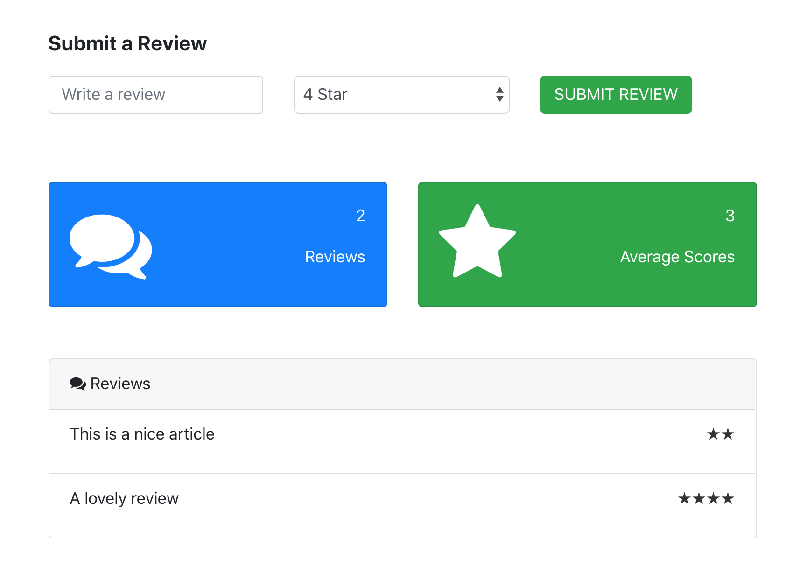

# react-mobx-reviews

<kbd></kbd>

Following the example provided by [Autho0's great React/MobX tutorial](https://auth0.com/blog/managing-the-state-of-react-apps-with-mobx/).

## Files of interest

- [src/App.js](src/App.js): Entry point of app.
- [src/store/index.js](src/store/index.js): Defines a global state/store object from which the app reads & writes from.
- [src/components/Form.js](src/components/Form.js)
- [src/components/Reviews.js](src/components/Reviews.js)
- [src/components/Dashboard.js](src/components/Dashboard.js)

## Running the app

```
git clone https://github.com/kim-nguyenkhn/react-mobx-reviews.git
npm i
npm start
# `npm start` will open up the app on your default browser at `http://localhost:3000`
```
